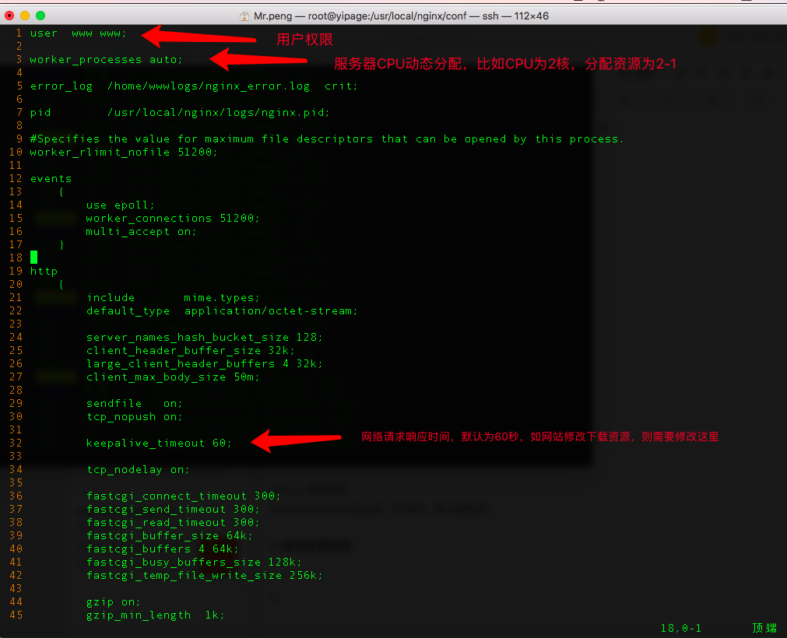
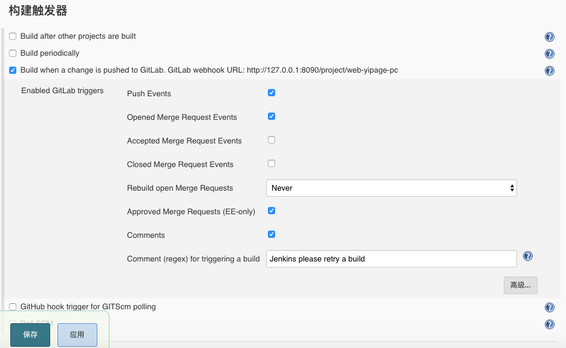
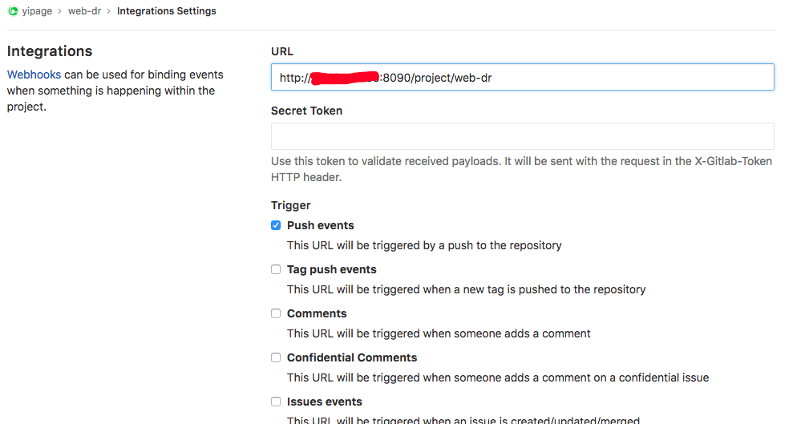
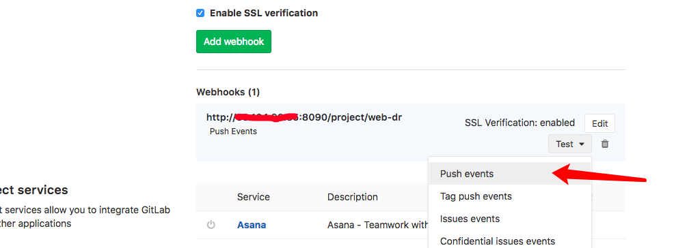

# Record the process and pit points of centOS 7.4

> 记录自己配置centOS 7.4 过程及坑点

目录
===

<!-- TOC -->

- [mac连接服务器](#mac连接服务器)
- [修复wget漏洞](#修复wget漏洞)
- [全局查找](#全局查找)
- [测试硬盘速度](#测试硬盘速度)
- [安装lnmp](#安装lnmp)
- [配置CA证书](#配置ca证书)
- [lnmp新建站点](#lnmp新建站点)
- [lnmp删除站点](#lnmp删除站点)
- [nginx基础配置](#nginx基础配置)
	- [配置站点](#配置站点)
	- [重启nginx](#重启nginx)
	- [查看nginx状态](#查看nginx状态)
	- [跨域问题](#跨域问题)
- [nginx性能优化](#nginx性能优化)
	- [内容缓存](#内容缓存)
	- [Gzip压缩](#gzip压缩)
	- [打开文件缓存](#打开文件缓存)
	- [SSL缓存](#ssl缓存)
	- [上游Keepalive](#上游keepalive)
- [监听端口](#监听端口)
- [安装node环境](#安装node环境)
- [防火墙配置](#防火墙配置)
- [部署gitlab](#部署gitlab)
- [常用gitlab命令](#常用gitlab命令)
- [完全卸载gitlab](#完全卸载gitlab)
- [配置gitlab](#配置gitlab)
- [监听服务器性能](#监听服务器性能)
- [排查TCP/IP错误](#排查tcpip错误)
- [部署jenkins](#部署jenkins)
- [部署api文档管理系统](#部署api文档管理系统)
- [MySQL配置](#mysql配置)
- [配置前端工程CI/CL](#配置前端工程cicl)
	- [前提](#前提)
	- [配置CI/CL](#配置cicl)
- [部署Docker](#部署docker)

<!-- /TOC -->
---

### mac连接服务器

```shell
// 切换到 root 权限下
sudo -i

// 连接
ssh root@xxx.xxx.xxx.xxx
```

### 修复wget漏洞
```shell
yum update wget
```

### 全局查找
```shell
whereis xxx
```

### 测试硬盘速度
```shell
// 写入速度
dd if=/dev/zero of=./largefile bs=1M count=500
// 清理内存（读取前必须进行，不然不准确）
sudo sh -c "sync && echo 3 > /proc/sys/vm/drop_caches"
// 读取速度
dd if=./largefile of=/dev/null bs=4k
```

### 安装lnmp
```shell
wget -c http://soft.vpser.net/lnmp/lnmp1.4.tar.gz

tar zxf lnmp1.4.tar.gz

cd lnmp1.4

./install.sh lnmp

// 注意的是MySQL 5.6,5.7及MariaDB 10必须在1G以上内存的更高配置上才能选择！
```

### 配置CA证书
```shell
1. 从阿里云上申请免费的ca证书（有点隐秘，需要找到“一个域名”）

2. 阿里的ca证书有一个 pem 文件和 key 文件，解压后，分别把名字改为 'ssl.pem'，'ssl.key'

3. Mac将本地文件上传到服务器上（在服务器中新建 /home/ssl 文件夹）
	scp -P 22 /Users/Mr.peng/Downloads/214577254120798/ssl.key root@xxx.xxx.xxx.xxx:/home/ssl
	scp -P 22 /Users/Mr.peng/Downloads/214577254120798/ssl.pem root@xxx.xxx.xxx.xxx:/home/ssl

4. 当后期若需证书改名
	cd /home/ssl
	mv ssl.key ssl2.key
	mv ssl.pem ssl2.pem
```

### lnmp新建站点
```shell
lnpm vhost add
//ssl文件放在 /home/ssl 目录下（ss.key、ssy.pem）
```

### lnmp删除站点
```shell
lnpm vhost del
chattr -i 网站目录/.user.ini
rm -rf 网站目录
```

## nginx基础配置



### 配置站点

```shell
// 查看配置文件位置信息
nginx -V

// 站点配置文件
lnmp 默认网站配置文件：/usr/local/nginx/conf/nginx.conf
lnmp 默认网站配置文件：/usr/local/nginx/conf/nginx.conf 和 /usr/local/apache/conf/extra/httpd-vhosts.conf
lnmp 默认网站配置文件：/usr/local/apache/conf/extra/httpd-vhosts.conf
新增站点配置文件：/usr/local/nginx/conf/vhost/域名.conf

// lnmp 管理页面
/home/wwwroot/default2（已关闭，防止被攻击）
```

### 重启nginx
```shell
lnmp nginx reload
//有时候报错：
Reload service nginx... nginx: [error] open() "/usr/local/nginx/logs/nginx.pid" failed (2: No such file or directory) done

//解决：
/usr/local/nginx/sbin/nginx -c /usr/local/nginx/conf/nginx.conf
```

### 查看nginx状态
```shell
ps -ef | grep nginx
```

### 跨域问题

在工作中，有时候会遇到一些接口不支持跨域，这时候可以简单的添加add_headers来支持cors跨域。配置如下：

```nginx
server {
  listen 80;
  server_name api.xxx.com;
    
  add_header 'Access-Control-Allow-Origin' '*';
  add_header 'Access-Control-Allow-Credentials' 'true';
  add_header 'Access-Control-Allow-Methods' 'GET,POST,HEAD';

  location / {
    proxy_pass http://127.0.0.1:3000;
    proxy_set_header X-Real-IP $remote_addr;
    proxy_set_header X-Forwarded-For $proxy_add_x_forwarded_for;
    proxy_set_header Host  $http_host;    
  } 
}
```

## nginx性能优化

### 内容缓存

允许浏览器基本上永久地缓存静态内容。 Nginx将为您设置Expires和Cache-Control头信息。

```nginx
location /static {
    root /data;
    expires max;
}
```

如果要求浏览器永远不会缓存响应（例如用于跟踪请求），请使用-1。

```nginx
location = /empty.gif {
    empty_gif;
    expires -1;
}
```

### Gzip压缩

```nginx
gzip  on;
gzip_buffers 16 8k;
gzip_comp_level 6;
gzip_http_version 1.1;
gzip_min_length 256;
gzip_proxied any;
gzip_vary on;
gzip_types
    text/xml application/xml application/atom+xml application/rss+xml application/xhtml+xml image/svg+xml
    text/javascript application/javascript application/x-javascript
    text/x-json application/json application/x-web-app-manifest+json
    text/css text/plain text/x-component
    font/opentype application/x-font-ttf application/vnd.ms-fontobject
    image/x-icon;
gzip_disable  "msie6";
```

### 打开文件缓存

```nginx
open_file_cache max=1000 inactive=20s;
open_file_cache_valid 30s;
open_file_cache_min_uses 2;
open_file_cache_errors on;
```

### SSL缓存

```nginx
ssl_session_cache shared:SSL:10m;
ssl_session_timeout 10m;
```

### 上游Keepalive

```nginx
upstream backend {
    server 127.0.0.1:8080;
    keepalive 32;
}
server {
    ...
    location /api/ {
        proxy_pass http://backend;
        proxy_http_version 1.1;
        proxy_set_header Connection "";
    }
}
```

### 监听端口
```shell
#监听全部
netstat -ntlp

#监听81端口
netstat -inp | grep 81
```

### 安装node环境

+ 首先安装 nvm

```shell
cd /usr/local/src

//下载安装包
wget https://github.com/cnpm/nvm/archive/v0.23.0.tar.gz

//解压
tar zxvf v0.23.0.tar.gz
rm -rf v0.23.0.tar.gz
cd nvm-0.23.0

//添加全局依赖
./install.sh
source ~/.bash_profile

//查看 nvm 是否安装成功
nvm
```

+ 安装 node 

```shell
//查看 node 版本列表
nvm ls-remote

//安装，我这里选用 v8.9.0 版本
nvm install v8.9.0

//设置为默认版本
nvm use node
nvm alias default v8.9.0

//查看 node 是否安装成功
node --version
npm --version
```

+ 安装 cnpm

```shell
npm install -g cnpm --registry=https://registry.npm.taobao.org
cnpm --version
```

### 防火墙配置
```shell
//查看firewalld状态（dead为未开启）
systemctl status firewalld

//开启防火墙
systemctl start firewalld

//关闭防火墙
systemctl stop firewalld
```

### 部署gitlab
> 首先执行上面的开启防火墙

```shell
// 安装配置ssh，配置防火墙
sudo yum install -y curl policycoreutils-python openssh-server
sudo systemctl enable sshd
sudo systemctl start sshd
sudo firewall-cmd --permanent --add-service=http
sudo systemctl reload firewalld

// 安装配置postfix，用于邮件通知
sudo yum install postfix
sudo systemctl enable postfix
sudo systemctl start postfix

// 安装 gitlab 包
curl -sS https://packages.gitlab.com/install/repositories/gitlab/gitlab-ce/script.rpm.sh | sudo bash
sudo yum install gitlab-ce

// 修改访问路径
vim /etc/gitlab/gitlab.rb
external_url 'http://ip_address:new-port'

// 重置配置
sudo gitlab-ctl reconfigure
//往往会出现：ruby_block[supervise_redis_sleep] action run，会一直卡无法往下进行！
1、按住CTRL+C强制结束；
2、运行：sudo systemctl restart gitlab-runsvdir；
3、再次执行：sudo gitlab-ctl reconfigure

//查看当前配置信息
vim /var/opt/gitlab/gitlab-rails/etc/gitlab.yml

// 开启
sudo gitlab-ctl start

# 允许81端口访问
sudo firewall-cmd --permanent --zone=public --add-port=81/tcp
```

### 常用gitlab命令
```shell
# 重新应用gitlab的配置 
sudo gitlab-ctl reconfigure 

# 重启gitlab服务 
sudo gitlab-ctl restart 

# 查看gitlab运行状态 
sudo gitlab-ctl status 

#停止gitlab服务 
sudo gitlab-ctl stop 

# 查看gitlab运行日志 
sudo gitlab-ctl tail 

# 停止相关数据连接服务 
gitlab-ctl stop unicorn gitlab-ctl stop sidekiq
```
### 完全卸载gitlab
```shell
# 停止进程
sudo gitlab-ctl stop

# 卸载（卸载掉ce || ee, 看情况而定）
rpm -e gitlab-ce

# 查看gitlab进程
ps aux | grep gitlab

# 杀掉进程（后面很多个点的那个进程）
kill -9 18777

# 杀掉所有 gitlab 有关的文件
find / -name gitlab | xargs rm -rf
```

### 配置gitlab
```shell
#新建站点
lnmp vhost add (git.yipage.cn)

#修改站点配置
#1.注释 index 指向
#2.添加反向代理
location ~ / {
    proxy_pass http://127.0.0.1:81
}

#测试
nginx -t

#重启
lnmp nginx reload
```

### 监听服务器性能
```shell
#安装dstat
yum -y install detat

#全局监听
dstat -antp 3

#监听消耗cpu最高，内存消耗最大的进程，每3秒打印一次
dstat -antp --top-cpu --top-mem 3

#查看谁在占用内存资源
dstat -g -l -m -s --top-mem

#关于CPU资源损耗的数据
dstat -c -y -l -proc-count --top-cpu
```

### 排查TCP/IP错误
```shell
#首先在服务器端请求网站
curl http://xxx.xxx.xxx.xxx:81

#服务器没问题，在客户端发起请求
curl http://xxx.xxx.xxx.xxx:81

#监听81端口下的网络请求包
tcpdump 'tcp port 81'

#若没有动静，说明客户端的请求没有到达服务器端，这个时候就很有可能是防火墙的问题。

#解决1：如果是自配的服务器
#查看firewalld状态（dead为未开启）
systemctl status firewalld
#开启防火墙
systemctl start firewalld
#手动打开81端口的防火墙
sudo firewall-cmd --permanent --zone=public --add-port=81/tcp

#解决2：如果是阿里云或者腾讯云的服务器，需要登录上云平台，找到服务器下的安全组，添加安全组规则，如果不知道要配置的域名是什么，将授权对象设置为 0.0.0.0/0

#解决3：可以通过访问80端口，再通过nginx反向代理到81端口，这样子就可以绕过防火墙。
```

### 部署jenkins
+ 安装 jdk

```shell
yum -y list java*
yum -y install java-1.8.0-openjdk.x86_64
java
```
+ 安装jenkins

```shell
#下载jenkins包
wget http://pkg.jenkins-ci.org/redhat-stable/jenkins-2.107.1-1.1.noarch.rpm
rpm -ivh jenkins-2.107.1-1.1.noarch.rpm

#修改配置文件，默认端口为8080，如果不冲突则不需要修改
vim /etc/sysconfig/jenkins

#启动jenkins服务
service jenkins start

#重启jenkins
service jenkins restart

#查看jenkins密码并复制
vim /var/lib/jenkins/secrets/initialAdminPassword
```
+ 部署站点

```shell
#部署ca证书
#Linux : 
cd /home & mkdir ssl-build
#Mac :  
scp -P 22 /Users/Mr.peng/Downloads/ca证书/ssl-build/ssl.pem root@39.104.92.85:/home/ssl-build
scp -P 22 /Users/Mr.peng/Downloads/ca证书/ssl-build/ssl.key root@39.104.92.85:/home/ssl-build

#新建站点
lnmp vhost add ( build.yipage.cn )

#修改站点配置
#1.注释 index 指向
#2.添加代理
location ~ / {
    proxy_pass http://127.0.0.1:8090
}

#测试
nginx -t

#重启
lnmp nginx reload
```

+ 完全卸载 jenkins

```shell
#停止服务
sudo service jenkins stop

#卸载jenkins包
sudo yum remove jenkins

#删除偏好设置
sudo rm -r /var/lib/jenkins
```


### 部署api文档管理系统

```shell
#添加域名解析
api.yipage.cn

#传输ca证书
scp -P 22 /Users/Mr.peng/Downloads/ca证书/ssl-api/ssl.pem root@39.104.92.85:/home/ssl-api
scp -P 22 /Users/Mr.peng/Downloads/ca证书/ssl-api/ssl.key root@39.104.92.85:/home/ssl-api

#新建站点
lnmp vhost add (api.yipage.cn)

#下载eolinker开源版
cd /home/wwwroot
git clone https://github.com/padipata/eoapi.git  (3.5.0版本)
cp -rf eoapi/. api.yipage.cn/

#设置权限
chmod 777 -R api.yipage.cn/

#重启nginx
nginx -t
lnmp nginx reload

#访问
https://api.yipage.cn
```


### MySQL配置
```shell
#启动服务
/etc/init.d/mysql start

#停止服务
/etc/init.d/mysql stop

#重启服务
/etc/init.d/mysql restart

#登录数据库
mysql -uroot -p

#绕过密码登录（需要先停止服务）
mysqld_safe --user=mysql --skip-grant-tables --skip-networking &

#连接数据库
> use mysql; 

#修改密码
> update user set password=password("123456") where user="root";

#刷新权限
> flush privileges;

#退出
> quit;

#查看mysql日志文件
/usr/local/mysql/var/
ll
vim mysql-bin.000001

#使用lnmp修改root密码
wget http://soft.vpser.net/lnmp/ext/reset_mysql_root_password.sh;sh reset_mysql_root_password.sh
```


## 配置前端工程CI/CL
### 前提
+ 环境
> jenkins 
> gitlab
+ 安全组
> 阿里云配置jenkins的安全组规则（我这里是打开8089端口）
+ jenkins环境
> 安装Gitlab Hook Plugin、GitLab Plugin、GitLab插件
> 在全局安全配置里面关闭用户提交权限
> 关闭禁用跨域访问

### 配置CI/CL
+ jenkins 配置


+ gitlab配置
进入 webhooks 配置页面


配置 jenkins 项目构建路径

进行测试


+ 注意事项
1. jenkins 可能出现找不到 GitLab Plugin 插件的情况，其实 GitLab 插件就是 GitLab Plugin ，安装即可。
2. gitlab webhooks 测试的时候可能会出现 403 的情况：
    1. url 书写错误，没有指向服务器
    2. jenkins 中的禁止跨域访问没有关掉
    3. jenkins 中的用户操作权限没有关掉
    4. 如果等待时间过长没反应，一般都是因为防火墙没有开启该端口，自配服务器需要手动开启端口，阿里云用户需要到安全组里面配置安全组规则

### 部署Docker
+ [学习文档](https://yq.aliyun.com/articles/63035?utm_campaign=wenzhang&utm_medium=article&utm_source=QQ-qun&utm_content=m_7538) 
+ [专业书籍](files/docker.pdf)